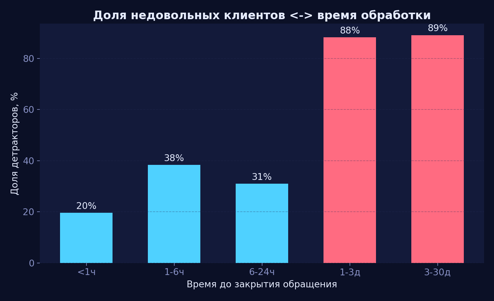
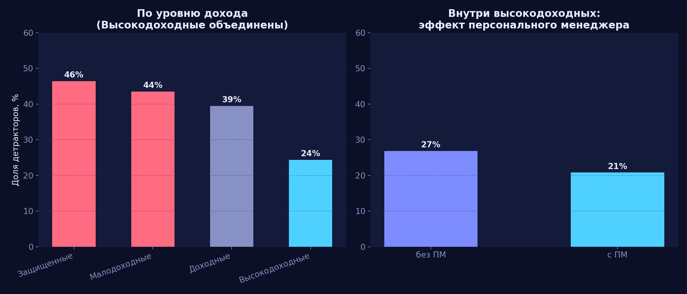
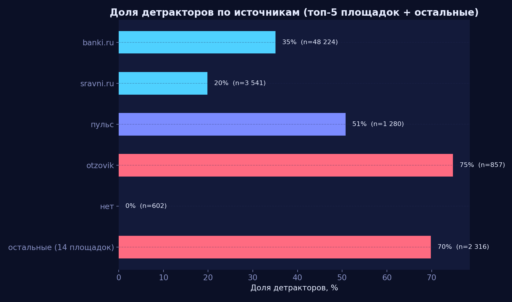
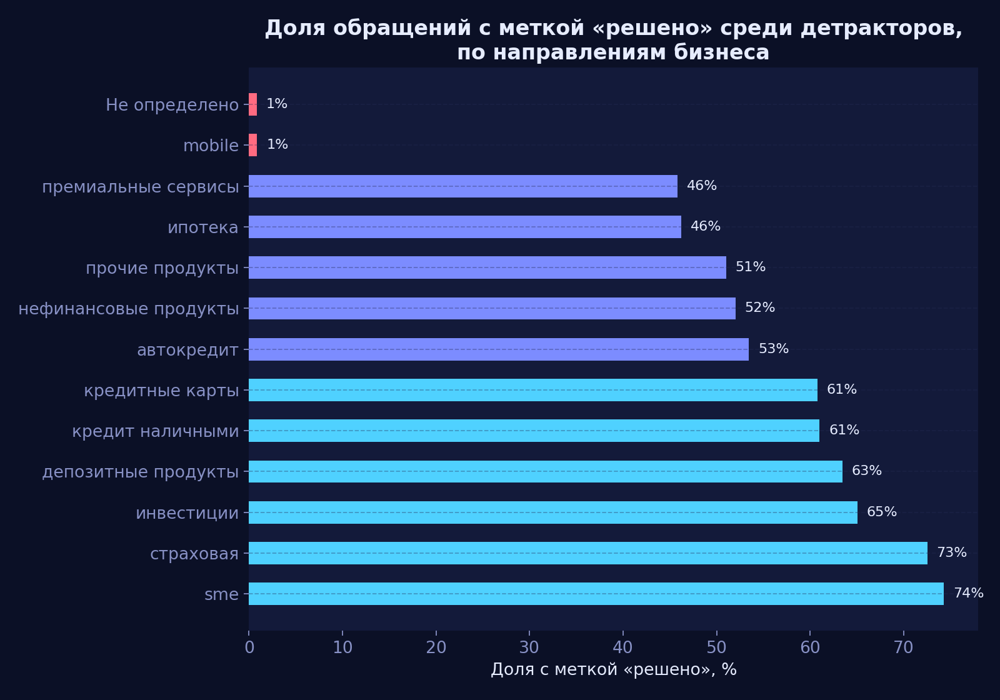
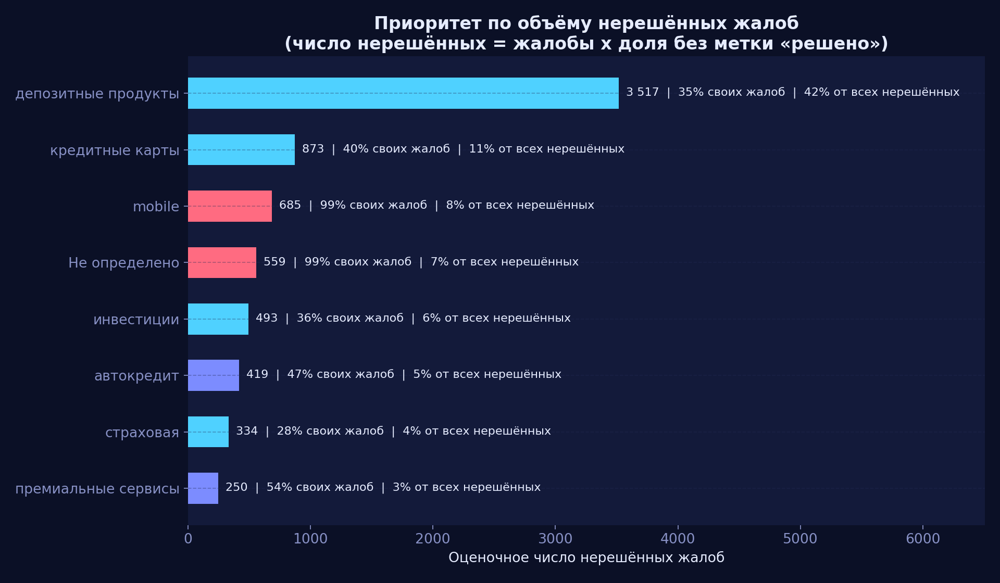
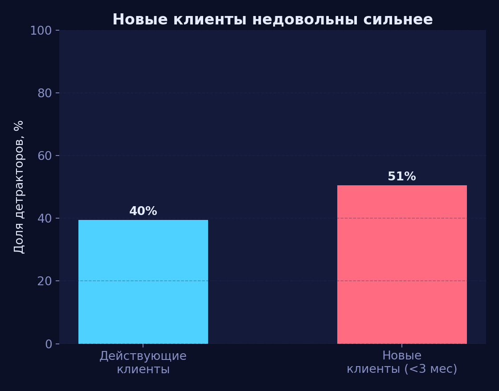
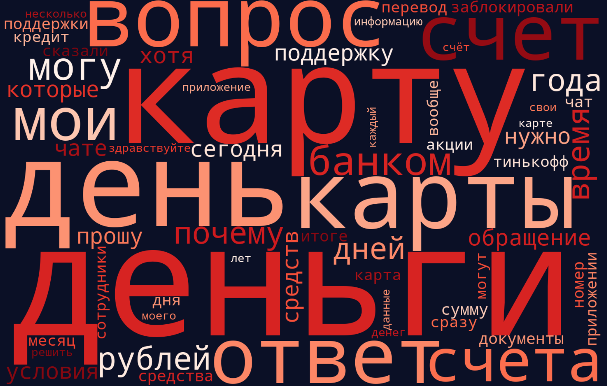
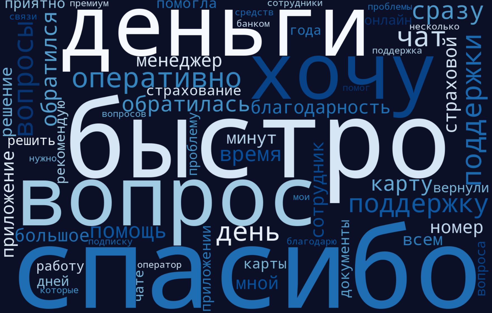
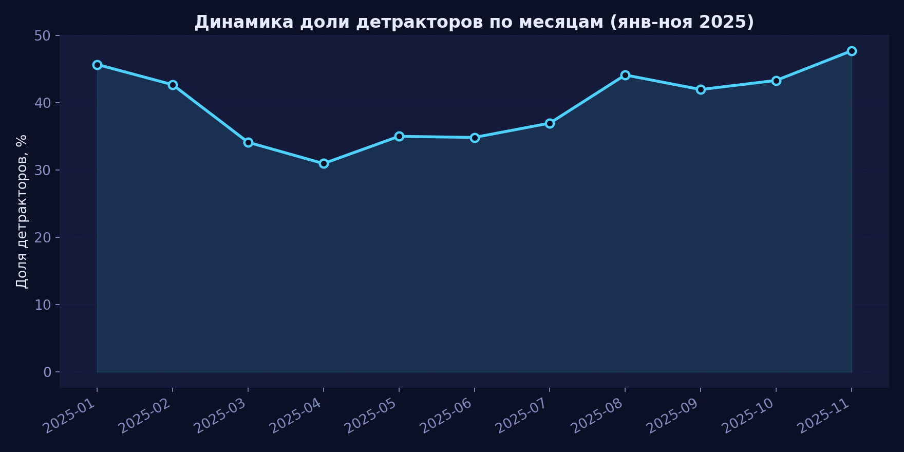

# Отзывы клиентов Т-Банка: где теряем лояльность

Кейс со вступительного тестирования **Т-Интенсива по продуктовой аналитике** (лето 2026). Датасет — 56 820 отзывов клиентов о продуктах и сервисе банка за январь-ноябрь 2025 года, собранных с 20 источников (banki.ru, sravni.ru, соцсети и др.).

**TL;DR:** проверил 5 гипотез о причинах недовольства клиентов статистическими тестами (Спирмен, ANOVA, хи-квадрат). По пути нашёл и исправил собственную методологическую ошибку в разметке промоутер/детрактор — она задевала одну из ключевых находок (про источники отзывов) и без исправления давала ложно-экстремальные цифры.

## Что внутри

- [`tbank_reviews_analysis.ipynb`](./tbank_reviews_analysis.ipynb) — полный анализ: аудит качества данных (включая разбор собственной ошибки в методике), 5 гипотез с тестами и честной интерпретацией, разбор по темам и направлениям бизнеса, облака слов по тексту отзывов, динамика за год, рекомендации.
- [`tbank_reviews_presentation.pptx`](./tbank_reviews_presentation.pptx) — презентация по итогам анализа (16 слайдов).
- [`images/`](./images) — графики в едином стиле.

Ноутбук выполнен целиком — все графики и цифры в нём результат реального запуска. Сам файл датасета в репозиторий не включён — это выгрузка Т-Банка, выданная участникам интенсива для задания, а не публичный дамп; в коде датасет ожидается рядом как `dataset-sots-seti.xlsx`.

## Ключевые находки

Контроль качества: нашёл и исправил ошибку в собственной разметке (клик, чтобы раскрыть)

Организаторы дали точную формулу: «нейтральные и позитивные без числовой оценки — промоутеры, негативные без оценки — детракторы». В первой версии анализа я по ошибке отнёс все отзывы «без оценки» к детракторам. Разница — 1 782 отзыва (3.1%), но она несимметрично легла на конкретные источники (624 — с площадки «пульс», 602 — без указанного источника) и превращала умеренную находку в ложно-экстремальную: «пульс» и безымянные обращения показывали 99–100% детракторов вместо реальных 50.8% и 0%. После исправления методики выводы остались в силе по направлению, но стали заметно спокойнее по цифрам — неожиданно ровные 99–100% на подвыборке сами по себе повод перепроверить методику.

### 1. Скорость обработки обращения связана с недовольством

По детрактор-флагу — сильно (rho = −0.47), но при проверке через официальный `csat_score` эффект почти исчезает (rho = 0.05) — вероятно, `csat_score` считается на узкой, уже эскалированной подвыборке. Не стоит обещать бизнесу линейный эффект от простого ускорения SLA.

### 2. Удовлетворённость растёт вместе с доходом клиента — и отдельно ещё раз с персональным менеджером

`segment_name` в задании не расшифрован. По контексту: `Защищённые` / `Малодоходные` / `Доходные` / `Высокодоходные` — сегментация по доходу, а `ПМ` — судя по тому, что этот суффикс встречается почти исключительно у клиентов с `subscription_important_flg = 1`, скорее всего означает наличие персонального менеджера (это моя интерпретация по паттерну данных, не официальное определение).

Важно: разбивка «с ПМ / без ПМ» есть только внутри `Высокодоходные` — у остальных трёх сегментов её нет. Сравнивать все 5 категорий в одном ряду некорректно, поэтому проверил в два шага: сначала доход (объединив оба «Высокодоходные» в одну группу), потом отдельно эффект персонального менеджера уже внутри одной доходной группы.

Оба эффекта подтвердились и независимо друг от друга: по доходу — монотонное падение с 46% до 24% (ANOVA F = 177.4, p < 0.001), и ещё раз внутри высокодоходных — с 27% до 21% при наличии персонального менеджера (χ² = 19.5, p < 0.001).

### 3. Разница между источниками отзывов значима, но умереннее, чем показала ошибочная первая версия анализа

banki.ru — 35%, sravni.ru — 20%, otzovik — 75% (95% ДИ [71.8%, 77.6%] — не шум маленькой выборки), «пульс» — 51%. У otzovik треть отзывов имеет тему «Не определено» против единиц процентов у banki.ru — вероятная причина повышенного негатива не «злее клиенты», а хуже разметка отзывов на этой площадке.

### 4. Охват поддержки различается по направлениям бизнеса в разы

От 0.9% решённых жалоб (mobile) до 74% (sme).

Приоритет для бизнеса разный в зависимости от того, что считать: депозитные продукты дают наибольший **абсолютный объём** нерешённых жалоб (42% всех нерешённых жалоб банка — просто по масштабу направления, 35% своих же жалоб не решены — около среднего), а mobile — это отдельная **процессная** проблема (всего 8% от общего объёма, но 99% своих же жалоб не решены).

### 5. Новые клиенты (стаж < 3 месяцев) заметно недовольнее действующих

50.5% против 39.5% детракторов.

Судя по темам жалоб (чаще — карты, акции, погашение кредитов; реже — кэшбек, платежи), дело не в объективно худшем продукте, а в трении первого касания — практический вывод в пользу усиленной заботы о клиенте в первые недели как ставки на LTV.

### 6. Облака слов по тексту отзыва подтверждают H1 с другой стороны

У промоутеров доминируют «спасибо», «быстро», «оперативно», «поддержка» — язык благодарности за скорость. У детракторов — «деньги», «счёт», «вопрос», «ответ», «почему», «обращение» — язык ожидания ответа, а не жалоб на продукт как таковой.

<table>
<tr>
<td></td>
<td></td>
</tr>
</table>

**Задел на будущее:** сейчас облака построены по всей выборке. Следующий шаг — то же самое отдельно для `business_line = mobile` (где почти ничего не решается, см. находку 4) или по каждому источнику — это уже материал для конкретных правок в скриптах поддержки, а не только разведочный анализ.

### Динамика за год

Доля детракторов держится в спокойном диапазоне весь год, без резких обвалов.

### Что проверялось, но не подтвердилось

Влияние возраста клиента на оценку — проверил дважды (в среднем по выборке и отдельно внутри конкретных продуктов), эффекта не нашёл нигде, кроме одной наводки на выборке в 10-30 человек, которой недостаточно для вывода.

## Про качество данных (подробнее)

- `csat_score` — та же шкала 1-5, что и `review_mark`, а не отдельная метрика 0-1. Заполнена только у **6% отзывов** и смещена к 1 — похоже, считается в основном для уже эскалированных обращений.
- `solution_flg` — не булев флаг, а описательная метка процесса поддержки. Наивное сравнение «решено vs не решено» по всей выборке — артефакт отбора.
- 23.3% отзывов (13 212) не сопоставлены с профилем клиента в CRM (все 4 профильных поля пропущены строго одновременно) — и у этой группы доля недовольных заметно ниже среднего.

## Стек

Python, pandas, NumPy, scipy.stats (Spearman, ANOVA, χ²), matplotlib, pptxgenjs (презентация).
